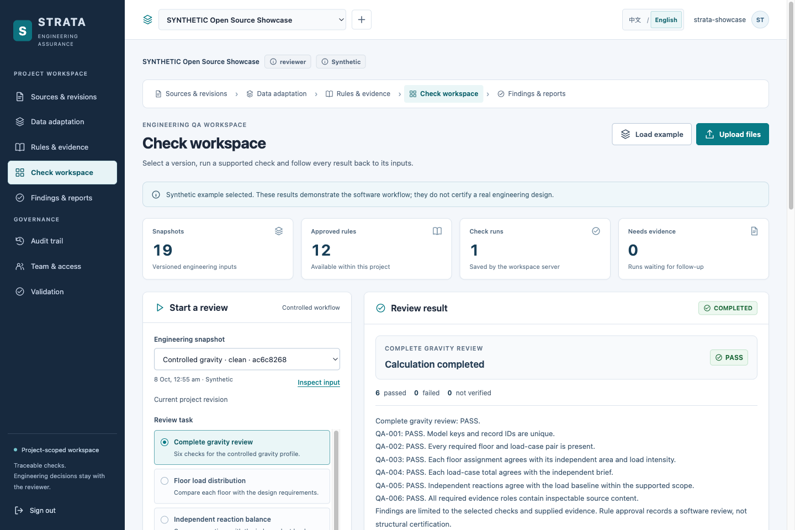

# STRATA — Evidence-Grounded Engineering QA Platform

[English](README.md) · **简体中文**

STRATA 是一个用于可追溯工程检查的本地工作平台。它将明确的输入数据、版本化规则和已注册的计算工具连接起来，在结果旁展示来源、数值依据和复核历史。

基础应用无需模型或付费 API。英文与简体中文界面使用同一份数据和计算逻辑。



## 功能

- **导入与映射资料：**支持 CSV、Excel（`.xlsx`）、JSON、文本、Markdown 和文本型 PDF。保存并复用字段与单位映射，查看原值、标准化值和来源位置。PDF 文本提取不会自动重建工程表格。
- **管理规则：**校验、导入和导出规则包，记录版本、适用条件、参数、容差、引用及草稿／批准／退役状态。配置调用已有工具，不执行任意公式或代码。
- **检索依据：**使用 BM25，按项目、任务、版本和批准状态过滤，并返回来源引用。
- **执行受控检查：**在工具声明的数据契约内完成重力 QA、线性组合算术、配置检查和源数据到目标数据的对照。结果显示为通过／未通过／未验证，内部值保持 `PASS`、`FAIL`、`NOT VERIFIED`，同时展示计算记录和补材料清单。
- **复核变更：**保留旧快照和结果，创建关联重检，跟踪问题并记录人工复核。依赖变化会使旧确认失效。
- **导出可检查记录：**提供 HTML／JSON 报告、项目审计、持久化存储和备份恢复。查看者、工程师和复核员分别承担查看、编辑和批准权限。
- **使用双语界面：**八个页面采用浅色工作区与深色导航，提供响应式布局、本地图标、表格筛选／排序／分页及原位语言切换。

## 结果如何产生

```text
原始文件 → 映射后的快照 → 已批准规则 → 注册工具
         → 结果与依据 → 问题处理／重检 → 人工复核
```

确定性工具产生工程数值和判定。可选本地模型可以将自然语言请求路由到受支持的任务，但不能替换工具结果或批准设计。依据不足时返回 `NOT VERIFIED`，并明确列出所需材料。

技术栈为 Python 3.12、FastAPI、SQLAlchemy／SQLite、Node.js 计算工具及原生 JavaScript／CSS。无需前端框架或向量数据库。

## 本地运行

准备 **Python 3.12** 和 **Node.js 20.11+**，推荐 Node.js 22 或 24。首次安装需要联网获取已声明的 Python 依赖。

```sh
git clone https://github.com/Tony-oxxdcoco/strata-engineering-qa-platform.git
cd strata-engineering-qa-platform
npm run setup
npm start
```

打开 **http://127.0.0.1:4180**，自行创建账号。没有预设用户名或密码。创建项目后选择 **Load example** 体验内置合成案例，查看检查结果并导出报告。

本地账号、上传文件和保存记录位于 `.runtime/`。保留该目录以保存数据，分享源码时将其排除。每个安装实例独立保存数据。

## Docker

在 macOS／Linux 终端中使用基础 `compose.yaml`、独立 Compose 项目和一个空闲本地端口。以下示例使用 4181 端口及该项目专用的持久化卷：

```sh
export STRATA_SETUP_TOKEN="$(python3 -c 'import secrets; print(secrets.token_urlsafe(32))')"
STRATA_PORT=4181 docker compose -p strata-local up -d --build
```

打开 **http://127.0.0.1:4181**，在首次创建账号的表单中输入生成的操作员初始化令牌，再设置自己的登录凭据。令牌仅在本地保管，与登录密码分开。基础应用启动不会下载模型。

重启时使用相同项目名和端口，以保留该项目的数据卷。[Docker 配置与验证说明](docs/DOCKER.md)记录了验证范围和平台信息；上面的命令用于建立全新的本地实例。

## 可选模型与 OCR

如果 Ollama 已运行，且已经安装 `qwen2.5:7b` 等模型，可在启动时启用任务路由：

```sh
STRATA_OLLAMA_MODEL=qwen2.5:7b npm start
```

手动任务选择始终可用。模型安装和资源需求独立于基础应用，支持的配置见 `.env.example`。

可选 macOS Vision OCR 需要 Swift、`pdftoppm` 和 `STRATA_OCR_ENABLED=1`。扫描页保留原图、识别文本和更正历史。数值、正负号、单位及表格列对应关系必须经人工核对，确认后的转录才可支持检查。Linux 容器未启用 OCR。

## 验证

当前版本的实测范围见[发布验证](docs/RELEASE_VERIFICATION.md)。

对当前源码运行检查：

```sh
npm run setup:dev
npm test
npm run check
npm run check:i18n
.venv/bin/python -m pytest -q
```

Windows 最后一条命令改用 `.venv\Scripts\python.exe`。[验证说明](docs/frontend/VERIFICATION.md)和[已有收据](docs/frontend/)保留对应源码版本、环境、失败记录及未验证范围。测试数量和合成案例的匹配结果属于软件证据，不代表工程准确率。

## 扩展 STRATA

| 改动 | 入口 |
|---|---|
| 文件格式、字段别名和单位映射 | `backend/strata/adapters.py`、`backend/strata/data_tools.py` |
| 规则契约和规则包校验 | `backend/strata/contracts.py`、`backend/strata/adaptation_api.py` |
| 注册检查与工作流 | `backend/strata/data_tools.py`、`dist/`、`backend/strata/workflow.py` |
| 依据检索与任务路由 | `backend/strata/knowledge.py`、`backend/strata/model.py` |
| 独立案例与评测 | `backend/strata/cases.py`、`examples/`、`backend/tests/` |
| 界面组件与翻译 | `web/ui-foundation.js`、`web/design-system.css`、`web/locales/` |

具体扩展步骤见[适配指南](CLIENT_ADAPTATION.md)。新工程方法需要实现工具并进行独立验证；修改提示词或规则参数不会自动新增已经验证的方法。

## 范围与限制

- 内置规则、数据和预期答案均明确标为合成测试材料。软件 `PASS` 不代表结构安全认证或工程师验收。
- 受控重力与数值组合检查仅接受合成输入。组合算术假设线性静力响应；配置对照检查的是明确提供的条件，不据此认定符合工程规范。
- 只读 ETABS／SAFE 连接器已验证模拟契约。接入有许可的 Windows 软件和真实工程模型仍需单独验证。
- 已保存的安装与浏览器证据只覆盖指定环境。原生 Windows／Linux 安装器、真实手机／Safari、生产部署及独立工程验收仍有待验证事项。

## 贡献与许可

贡献方式见 [CONTRIBUTING.md](CONTRIBUTING.md)。源码采用 [MIT License](LICENSE)。
